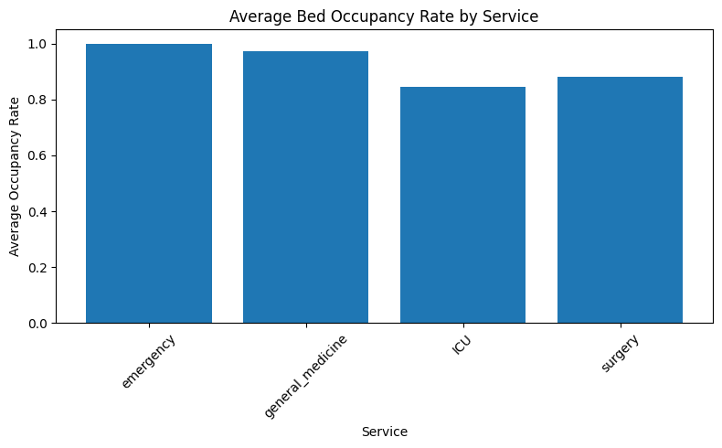
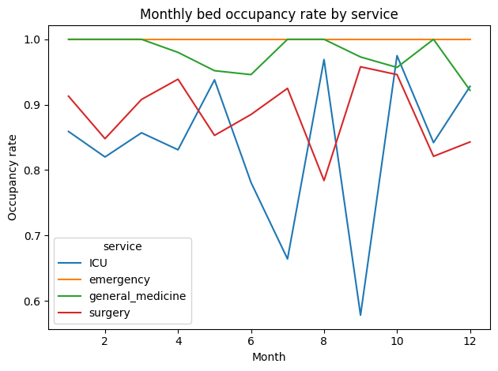
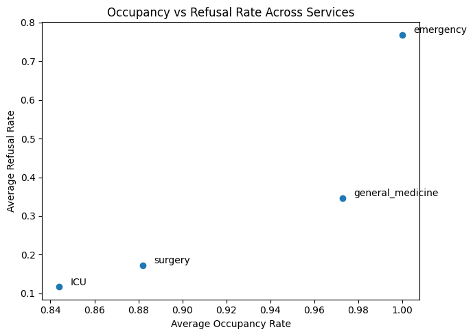
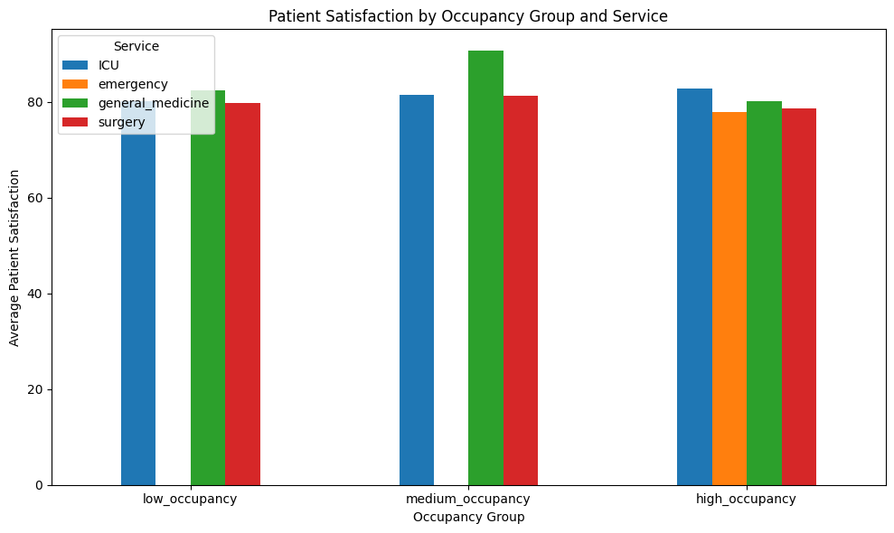
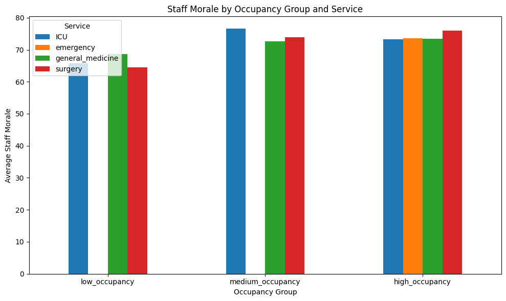
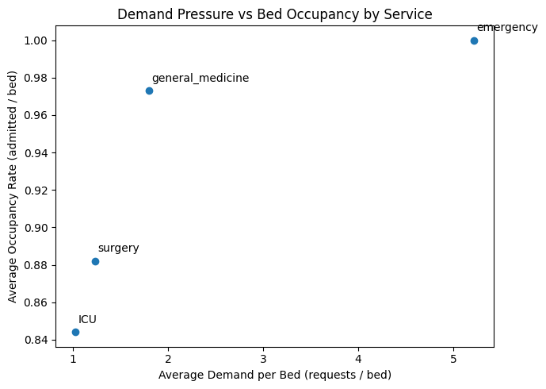

# Hospital Bed Management Analysis 
## Introduction 
  All around the country, hospitals and clinics are suffering from severe increases in 
patient needs while staffing levels consistently decrease and bed availability is finite. Now, 
there is no perfect solution to this problem, however asking the correct questions and 
analyzing relevant data should reveal meaningful insights into bed management, 
staffing/resource allocation, patient satisfaction, etc. These insights would aid in finding 
patterns and inconsistencies that would motivate further research to make real policy 
decisions. 
  I hypothesize that to understand this issue better, it would be best to explore bed 
management as it is intuitively the reason behind other issues within the hospital such as 
staffing and patient satisfaction. To gain insights into bed management, the following 
research questions will be answered: 
- Which services experience the highest bed occupancy, and how do 
occupancy patterns change over time? 
- How does bed occupancy relate to patient refusal rates across services? 
- How does high bed occupancy aƯect patient satisfaction and staƯ morale?
- How does patient demand (requests vs admissions) contribute to occupancy 
pressure?
## Data Overview 
  For this research, the data used is Hospital Beds Management from Kaggle. This 
data is synthetically created to match hospital records for one full year that the 
administration would use. It includes four datasets: 
- hospital_staff: Each row represents a single staff member, including their 
role, assigned service, and a unique identifier.
- hospital_patients: Each row represents a single patient and includes 
demographic information, service assignment, stay duration, and 
satisfaction scores. 
- hospital_service_weekly: Each row represents a single service for a specific 
week.
- hospital_staff_schedule: Each row represents a single staff member for a 
specific week, indicating whether they were present or absent. The schedule 
combines rotation patterns and random leave (holidays or sick leave) to 
simulate realistic staffing.

Originally, my analysis focused on staffing more than bed management (e.g. how 
the presence of staff affects other service level outcomes in the hospital). However, since 
the data is synthetic, it seems there has been an error in how certain columns were created 
in the staff schedule data. It would show that every three weeks, no staff were present at all 
in the hospital, which is obviously inaccurate and not representative of real hospital data.
So, I changed the frame of the project to be about the beds and not the staff. 

## Results
The data show relatively full occupancy across all services with minor variation in 
how many patients are admitted to that service. In Figure 1, emergency services, on 
average, have the highest occupancy rate (patients admitted / available beds), while ICU 
services have the least. 

Since Figure 1 does not give a whole lot of detail, I will see where there might be 
variation among the services by modeling the occupancy rate over time (12 months). In 
Figure 2, there is no clear trend or pattern that might indicate an intervention on one or all 
the services. For now, it just supports intuition that emergency services would have the highest 
occupancy given its importance as a first step before the other specialized services. In the
non-emergency services, there do seem to be some months with much higher occupancy rates and some 
with much lower. This could be an indication that certain events (e.g. flu season) are affecting 
occupancy. 

Next, I wanted to see how bed occupancy affects how many patients are “refused” 
care. Naturally, as beds fill up more patients would be refused admittance because there is 
not enough room, which subsequently affects patient satisfaction and could lead to worse 
patient outcomes due to delay of care. So, modeling this relationship shows the harm that 
high occupancy rates could have on patient refusal rates and other potential outcomes. 

In Figure 3, a scatterplot shows average occupancy rates vs. average refusal rates 
across all services. It is clear that emergency services are always at capacity and because 
of that they are having to refuse patients at a similar rate. It is interesting that general 
medicine has almost as high of an occupancy rate but a much lower refusal rate which may 
indicate that general medicine is more prepared to take on increasing occupants as 
opposed to emergency services. The rates for surgery and ICU make sense because patients who 
need admittance to these services rarely get turned away as they are truly in need of surgery or
intensive care. All non-emergency services have some awareness that certain patients are being 
admitted to their service prior to them arriving thus giving time to possibly prepare staff, 
beds, etc. Overall, bed occupancy is positively related to patient refusal rates and is most 
exhibited in emergency services mainly due to the unscheduled nature of emergencies. 

Now, to further show how bed occupancy affects patient outcomes, I will model the 
relationship between occupancy rate and patient satisfaction/staff morale. In Figure 4, it 
seems that there is not much variation in patient satisfaction given occupancy level. 
Emergency services are only shown in the high occupancy group because for all 52 weeks it 
is at max capacity. Only slightly does patient satisfaction decrease with increased 
occupancy. In Figure 5 surprisingly the staff morale increases as occupancy increases. In 
my experience in a hospital, this is not the case. Typically, in a hospital setting, the more 
patients there are the less staffed the hospital will be, making it a much less enjoyable shift 
for staff. Overall, this shows that occupancy might not have as big an effect as we thought 
on patient satisfaction.

Lastly, I will show the relationship between patient demand (patient requests / available 
beds) and occupancy rate. This analysis will further explain which services demand more 
resources/space and if there are any inconsistencies across services. Here, emergency services experience the 
highest demand per bed, well over their capacity (1 person per bed). The other services operate slightly above their 
capacity but are still able to handle the influx of occupants much better due to decreased demand pressure. Overall, 
emergency services cannot meet their demand. 

## Conclusion
This analysis shows that bed management plays a role in shaping service-level outcomes 
across the hospital. While all services operate at almost max occupancy, emergency 
services consistently face the most demand and have much higher refusal rates than the 
other services. General medicine, ICU, and surgery show lower refusal rates and more 
stable patient flow, which could indicate that the non-emergency services either know how 
to process patients better or their patient load is more predictable given that a patient is 
most often seen in an ER first. Contrary to what I had originally believed, high occupancy 
rates did not affect patient satisfaction in an observable way, nor did it have the intended 
effect on staff morale. Still, the overall patterns show where most resources and further 
interventions are needed: emergency services. The synthetic data did have its limitations 
but was able to reveal meaningful insights on bed management and how it relates to 
hospital performance.

